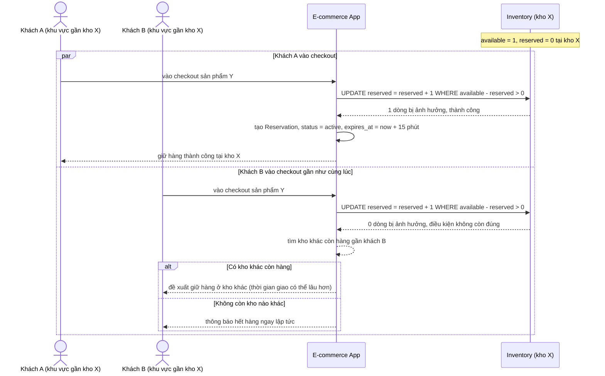

# Sequence - Enhance - Flow "checkout-reserve"

Đây là **enhance**, cùng flow `checkout-reserve` như ở base nhưng thay đọc-rồi-ghi bằng update nguyên tử `UPDATE inventory SET reserved = reserved + 1 WHERE available - reserved > 0`, đáp ứng yêu cầu 1: chỉ 1 trong 2 khách giữ được hàng, người thua nhận thông báo ngay và được đề xuất kho khác hoặc báo hết hàng. Mỗi lần giữ thành công đều tạo 1 dòng `Reservation` có TTL riêng, đáp ứng yêu cầu 2.

