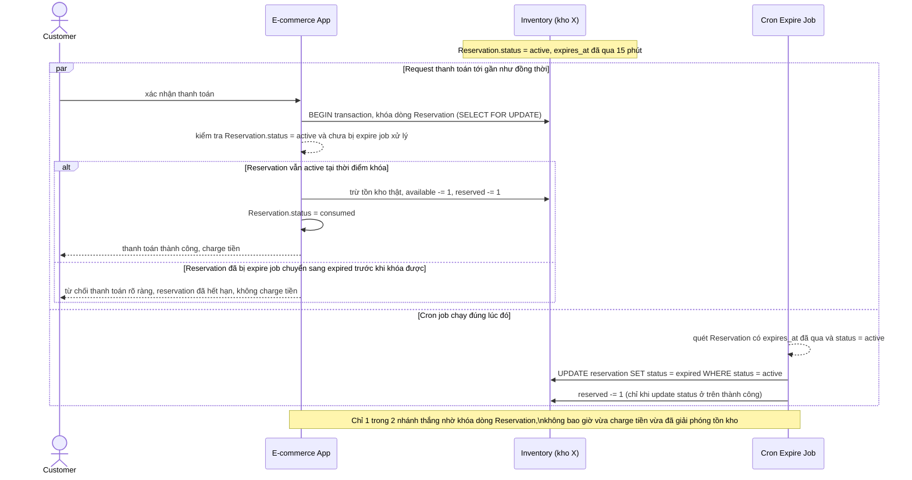

# Sequence - Enhance - Flow "expire-reservation"

Đây là **enhance**, cùng flow `expire-reservation` như ở base nhưng thay blind-decrement bằng kiểm tra trạng thái tường minh trên bảng `Reservation`, đáp ứng yêu cầu 3: transaction thanh toán phải kiểm tra reservation vẫn còn `status = active` ngay trước khi trừ tồn kho thật, nếu đã bị job expire chuyển sang `expired` thì từ chối thanh toán rõ ràng và không charge tiền - thay vì tình trạng mơ hồ như ở base.

