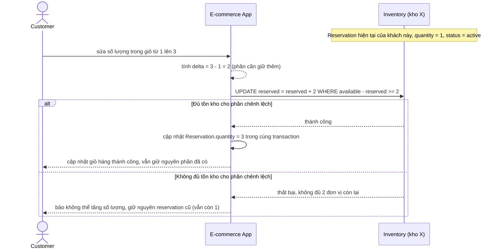

# Sequence - Enhance - Flow "update-cart-quantity"

Đây là **enhance**, cùng flow `update-cart-quantity` như ở base nhưng thay hủy-rồi-giữ-lại bằng 1 update nguyên tử tính đúng phần chênh lệch, đáp ứng yêu cầu 4: khi khách sửa số lượng từ 1 lên 3, hệ thống chỉ cần giữ thêm phần chênh lệch (2 đơn vị) trong cùng 1 thao tác, không có khoảng hở nào để người khác giành mất tồn kho đã giữ.

