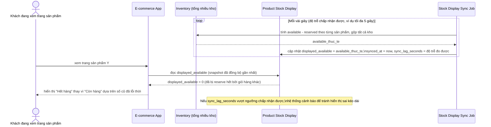

# Sequence - Enhance - Flow "stock-display-sync"

Đây là **enhance**, flow hoàn toàn mới so với base, đáp ứng yêu cầu 5: đồng bộ giữa tồn kho hiển thị công khai trên trang sản phẩm và tồn kho khả dụng thực (`available - reserved`), quy định độ trễ chấp nhận được và tránh hiển thị "còn hàng" khi thực chất đã được reserve hết bởi các giỏ hàng khác.

