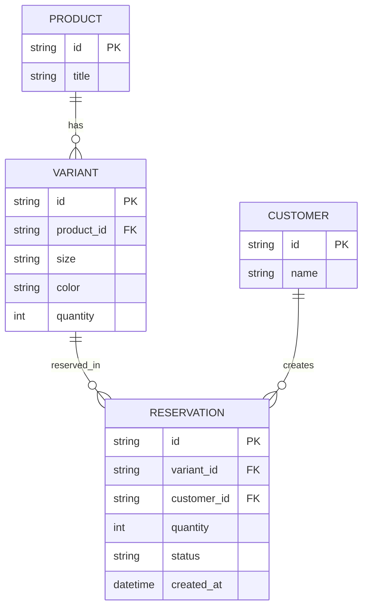

# ERD - Base (trước khi xử lý reservation đúng cấp biến thể)

Đây là **base**: mô hình dữ liệu tối thiểu của một sàn thời trang, mỗi sản phẩm có nhiều biến thể (size, màu), mỗi biến thể có tồn kho riêng. Chỉ giữ `Product`, `Variant`, `Customer`, `Reservation` - đủ để thấy vấn đề gốc: `Variant.quantity` là một cột đơn giản không có khóa nguyên tử theo tổ hợp size/màu, và không có gì phân biệt trạng thái "còn hàng" hiển thị tổng với tồn kho khả dụng thực của từng biến thể.

