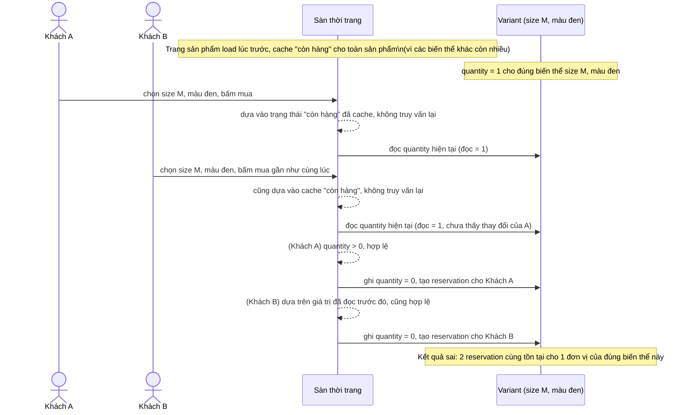

# Sequence - Base - Flow "purchase-variant"

Đây là **base**: khách bấm mua một biến thể cụ thể, hệ thống dùng lại trạng thái "còn hàng" đã cache từ lúc load trang sản phẩm và cập nhật tồn kho theo kiểu đọc trước - ghi sau, không khóa đúng theo tổ hợp biến thể. Flow này được chọn vì nó là tiền đề cho yêu cầu 1 (race giữa 2 khách chọn cùng 1 biến thể) và yêu cầu 3 (tin vào dữ liệu cache thay vì truy vấn lại tồn kho thực).

