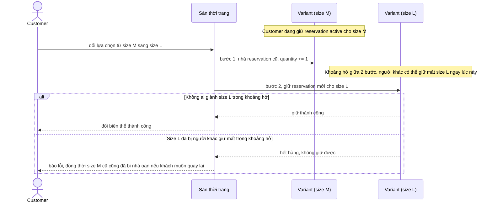

# Sequence - Base - Flow "change-variant-selection"

Đây là **base**: khi khách đổi biến thể (ví dụ từ size M sang size L) trong lúc đang giữ reservation, hệ thống nhả reservation cũ rồi giữ reservation mới bằng 2 bước tách rời. Flow này được chọn vì đây là cách làm mà yêu cầu 2 chỉ ra là có vấn đề: khoảng hở giữa 2 bước có thể khiến biến thể mới bị người khác giữ mất, hoặc biến thể cũ bị giữ dư thừa nếu bước sau thất bại.

