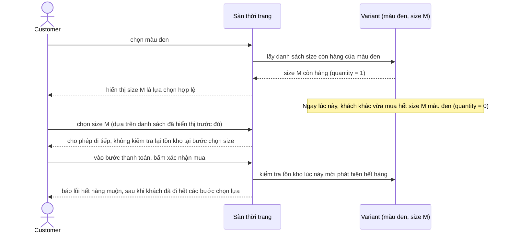

# Sequence - Base - Flow "select-variant-options"

Đây là **base**: giao diện chọn biến thể tuần tự (chọn màu trước, rồi mới hiện các size còn hàng của màu đó) dựa trên snapshot tồn kho lấy tại thời điểm chọn màu, không kiểm tra lại khi khách chọn xong size. Flow này được chọn vì nó là tiền đề cho yêu cầu 4 - tồn kho biến thể có thể đổi ngay trong lúc khách đang thao tác tuần tự, dẫn tới việc khách đi hết qua bước thanh toán rồi mới phát hiện hết hàng.

