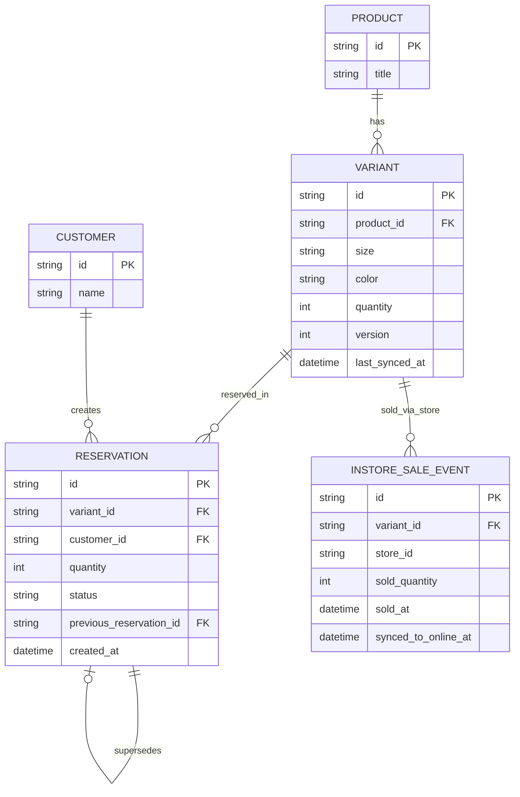

# ERD - Enhance (reservation atomic đúng cấp biến thể + đồng bộ omni-channel)

Đây là **enhance**: mô hình dữ liệu sau khi xử lý đúng reservation ở cấp biến thể. So với base, các thay đổi là:

- `VARIANT` có thêm `version` (dùng cho update nguyên tử khóa theo tổ hợp `product_id, size, color` - yêu cầu 1) và `last_synced_at` (mốc đồng bộ gần nhất từ kênh cửa hàng vật lý - yêu cầu 5).
- `RESERVATION` có thêm `previous_reservation_id` (tự tham chiếu, đánh dấu reservation này thay thế reservation biến thể cũ nào trong 1 thao tác đổi biến thể atomic - yêu cầu 2) và `status` mở rộng (`active` / `released` / `consumed`).
- `INSTORE_SALE_EVENT` (mới): mỗi lần 1 biến thể được bán tại cửa hàng vật lý, gồm `sold_at` và `synced_to_online_at` để đo độ trễ đồng bộ về tồn kho online của đúng biến thể đó (yêu cầu 5).

Yêu cầu 3 và 4 (luôn truy vấn lại tồn kho khả dụng thực tại thời điểm request, không dựa cache) không cần thêm entity mới - đây là thay đổi về hành vi đọc dữ liệu, thể hiện trong các sequence diagram bên dưới.

