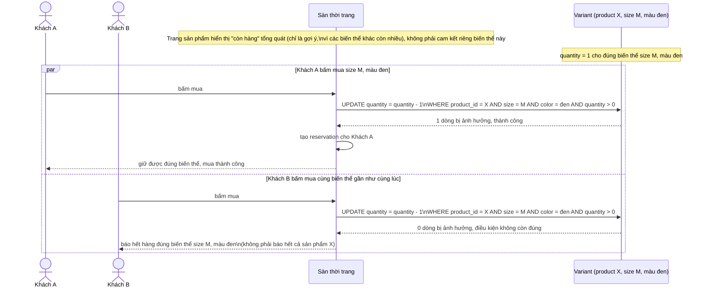

# Sequence - Enhance - Flow "purchase-variant"

Đây là **enhance**, cùng flow `purchase-variant` như ở base nhưng thay việc dùng cache và đọc-rồi-ghi bằng: (1) luôn truy vấn lại tồn kho khả dụng thực của đúng biến thể tại thời điểm bấm mua, không dựa vào trạng thái đã cache lúc load trang (yêu cầu 3), và (2) update nguyên tử khóa theo tổ hợp `(product_id, size, color)` chứ không phải theo product_id chung (yêu cầu 1). Khách thua chỉ nhận báo hết đúng biến thể đó, không phải báo hết cả sản phẩm.

