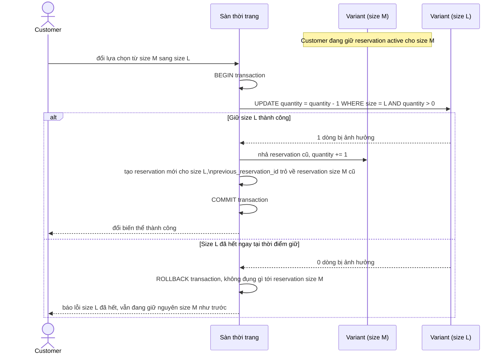

# Sequence - Enhance - Flow "change-variant-selection"

Đây là **enhance**, cùng flow `change-variant-selection` như ở base nhưng gộp nhả reservation cũ và giữ reservation mới vào 1 transaction atomic, đáp ứng yêu cầu 2: không có khoảng hở nào giữa 2 thao tác, và nếu giữ biến thể mới thất bại thì biến thể cũ không bị nhả oan.

