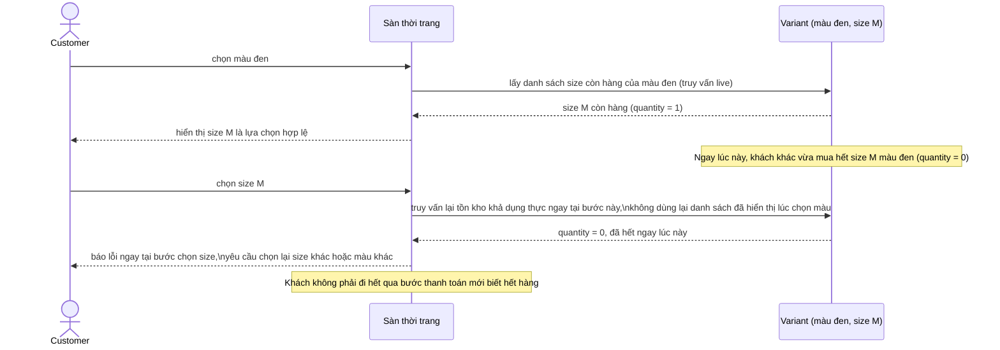

# Sequence - Enhance - Flow "select-variant-options"

Đây là **enhance**, cùng flow `select-variant-options` như ở base nhưng thêm bước kiểm tra lại tồn kho thực ngay tại thời điểm khách chọn xong lựa chọn phụ thuộc (size sau khi đã chọn màu), đáp ứng yêu cầu 4: nếu biến thể vừa hết ngay trong lúc khách thao tác tuần tự, lỗi được trả ngay tại bước đó thay vì để khách đi hết qua thanh toán rồi mới báo.

