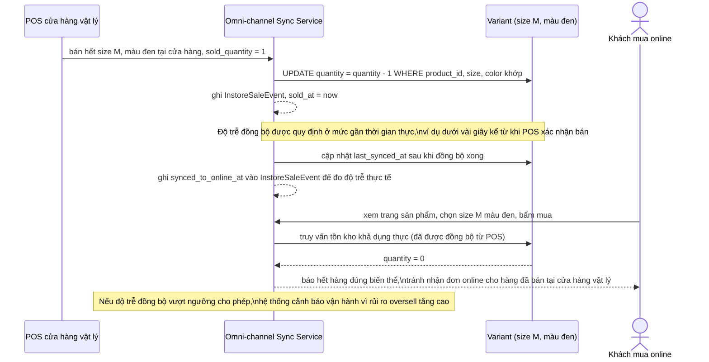

# Sequence - Enhance - Flow "instore-sale-sync"

Đây là **enhance**, flow hoàn toàn mới so với base, đáp ứng yêu cầu 5: khi kênh bán tại cửa hàng vật lý dùng chung tồn kho biến thể với kênh online, một biến thể vừa bán hết tại cửa hàng phải được đồng bộ kịp thời về tồn kho online của đúng biến thể đó, tránh nhận đơn online cho hàng thực tế đã không còn.

