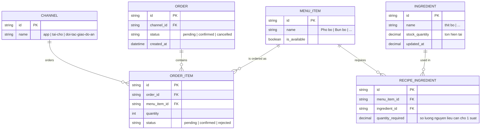

# Base ERD — Order F&B trước khi có atomic reservation nguyên liệu dùng chung

Đây là **base**: mô hình dữ liệu suy luận từ ngữ cảnh đề bài, mô tả trạng thái hệ thống order F&B **trước khi** áp cơ chế trừ tồn nguyên tử. Đề bài nói tới nhiều kênh bán (app, tại chỗ, đối tác giao đồ ăn) cùng đặt món có công thức dùng chung nguyên liệu từ 1 kho bếp — nên base cần đủ: món ăn, công thức (recipe) liên kết món với nguyên liệu và định lượng cần dùng, kho nguyên liệu có tồn hiện tại, và đơn hàng/dòng đơn ghi nhận món được gọi theo từng kênh. Ở base, việc trừ tồn được giả định làm đơn giản theo từng dòng đơn riêng lẻ, chưa có khái niệm transaction atomic gộp nhiều nguyên liệu/nhiều món, chưa có ngưỡng cảnh báo sắp hết, chưa có cơ chế hoàn trả có điều kiện thời gian — những phần đó là enhance.

