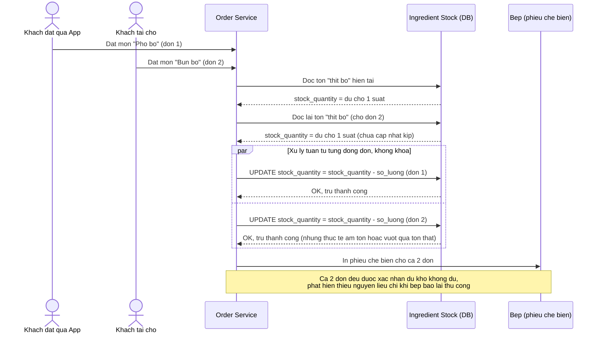

# Base sequence — Xác nhận đơn và trừ tồn nguyên liệu

Đây là **base**, mô tả flow xác nhận đơn hàng ở trạng thái hiện tại: hệ thống trừ tồn nguyên liệu tuần tự theo từng món trong đơn, không có khoá/điều kiện atomic, không kiểm tra đủ số lượng trước khi trừ theo kiểu nguyên tử. Đây chính là flow sẽ bị race condition khi 2 đơn từ 2 kênh khác nhau cùng cần chung 1 nguyên liệu gần hết, và là tiền đề để enhance thêm cơ chế atomic conditional update (yêu cầu 1 và 2 trong đề bài).

