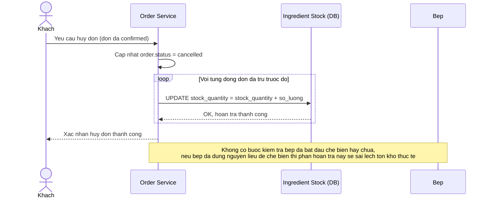

# Base sequence — Huỷ đơn và hoàn trả nguyên liệu

Đây là **base**, mô tả flow huỷ đơn ở trạng thái hiện tại: khách đổi ý, hệ thống hoàn trả lại nguyên liệu về kho theo kiểu cộng ngược đơn giản, không kiểm tra mốc thời gian bếp đã bắt đầu chế biến hay chưa. Đây là tiền đề cho enhance yêu cầu 4 trong đề bài — hoàn trả phải atomic và chỉ hợp lệ trước mốc bếp xác nhận bắt đầu chế biến.

