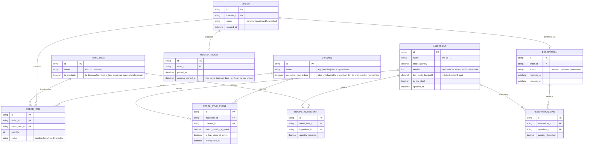

# Enhance ERD — Atomic reservation nguyên liệu dùng chung nhiều món

Đây là **enhance**, mô hình dữ liệu sau khi áp toàn bộ 5 yêu cầu trong đề bài lên base. So với base, các entity/field mới:
- `INGREDIENT` thêm `version` (phục vụ update nguyên tử có điều kiện đủ số lượng — yêu cầu 1) và `low_stock_threshold` + `is_low_stock` (yêu cầu 3, đánh dấu sắp hết theo thời gian gần thực).
- `RESERVATION` (mới) đại diện cho 1 giao dịch atomic gộp toàn bộ nguyên liệu của toàn bộ món trong 1 đơn khi xác nhận (yêu cầu 2), có `status` (reserved/released/consumed) và mốc `reserved_at`.
- `RESERVATION_LINE` (mới) là từng dòng trừ tồn cụ thể thuộc 1 `RESERVATION`, gắn `ingredient_id` + `quantity_deducted`, dùng để hoàn trả chính xác khi huỷ (yêu cầu 4).
- `KITCHEN_TICKET` (mới) ghi `cooking_started_at` — mốc thời gian rõ ràng quyết định đơn còn được huỷ-hoàn trả hay không (yêu cầu 4).
- `STOCK_SYNC_EVENT` (mới) ghi lại mỗi lần trạng thái tồn/ngưỡng của 1 nguyên liệu được broadcast tới các kênh, kèm `propagated_at` từng kênh, phục vụ theo dõi độ trễ đồng bộ và chặn nhận đơn mới khi phát hiện hết hàng (yêu cầu 5).

