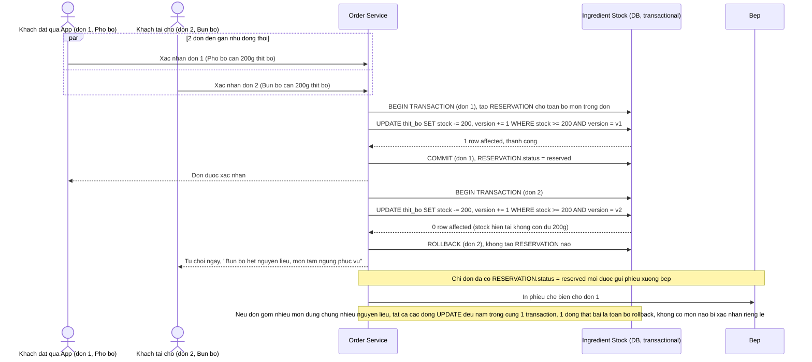

# Enhance sequence — Xác nhận đơn với atomic reservation nhiều nguyên liệu

Đây là **enhance** của flow `confirm-order` đã có ở base. So với base (trừ tồn tuần tự từng dòng, không khoá), flow này thay đổi ở chỗ: toàn bộ nguyên liệu của toàn bộ món trong 1 đơn được trừ trong 1 transaction atomic duy nhất bằng conditional update (`WHERE stock_quantity >= quantity_required AND version = current_version`), đáp ứng đúng kịch bản đề bài — đơn 1 (app, "Phở bò") và đơn 2 (tại chỗ, "Bún bò") cùng cần "thịt bò" nhưng kho chỉ đủ 1 suất (yêu cầu 1), và nếu 1 nguyên liệu bất kỳ trong đơn không đủ thì toàn bộ đơn rollback, không rơi vào trạng thái nửa xác nhận (yêu cầu 2).

