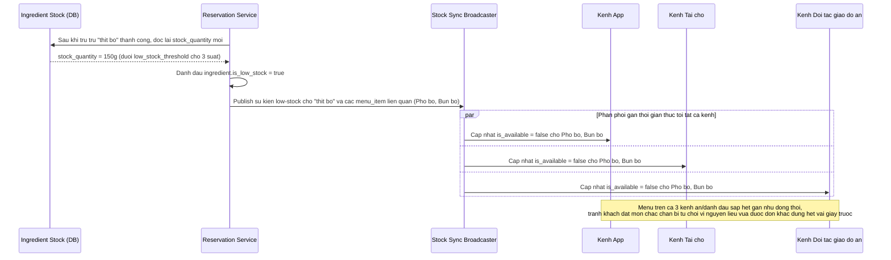

# Enhance sequence — Đánh dấu "sắp hết" theo thời gian gần thực trên mọi kênh

Đây là **enhance**, flow hoàn toàn mới so với base (base chưa có khái niệm ngưỡng cảnh báo hay đồng bộ trạng thái món qua kênh). Đáp ứng yêu cầu 3 trong đề bài: ngay sau khi 1 giao dịch trừ tồn khiến nguyên liệu xuống dưới ngưỡng cảnh báo, các món liên quan phải được đánh dấu "sắp hết"/ẩn trên mọi kênh gần như tức thời, tránh khách tiếp tục đặt món chắc chắn bị từ chối.

