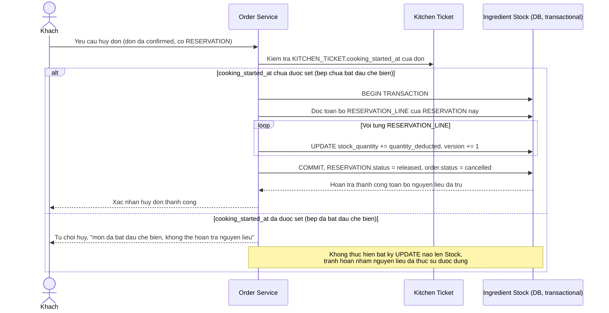

# Enhance sequence — Huỷ đơn với hoàn trả atomic có điều kiện thời gian

Đây là **enhance** của flow `cancel-order` đã có ở base. So với base (hoàn trả cộng ngược đơn giản, không kiểm tra bếp đã chế biến hay chưa), flow này thay đổi ở chỗ: trước khi hoàn trả, hệ thống kiểm tra `KITCHEN_TICKET.cooking_started_at` — chỉ hoàn trả atomic (dựa trên đúng các dòng `RESERVATION_LINE` đã trừ) nếu huỷ trước mốc bếp xác nhận bắt đầu chế biến, đáp ứng yêu cầu 4 trong đề bài.

