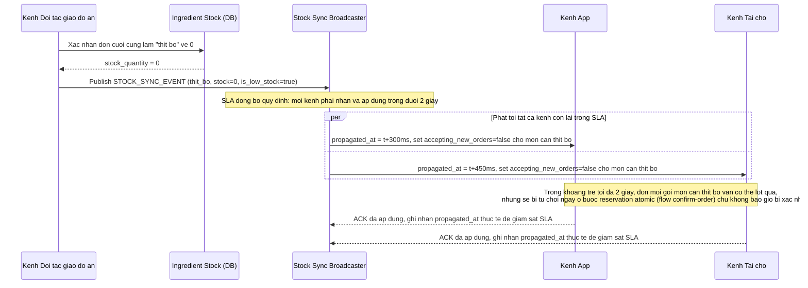

# Enhance sequence — Đồng bộ tồn kho liên kênh và chặn nhận đơn khi phát hiện hết hàng

Đây là **enhance**, flow hoàn toàn mới so với base (base không có khái niệm SLA đồng bộ hay tự chặn nhận đơn theo kênh). Đáp ứng yêu cầu 5 trong đề bài: quy định độ trễ đồng bộ chấp nhận được (ví dụ dưới 2 giây) giữa các kênh cùng dùng chung 1 kho vật lý, và cơ chế 1 kênh phát hiện nguyên liệu vừa hết phải lập tức chặn các kênh khác nhận đơn mới dựa trên số liệu đã lỗi thời.

