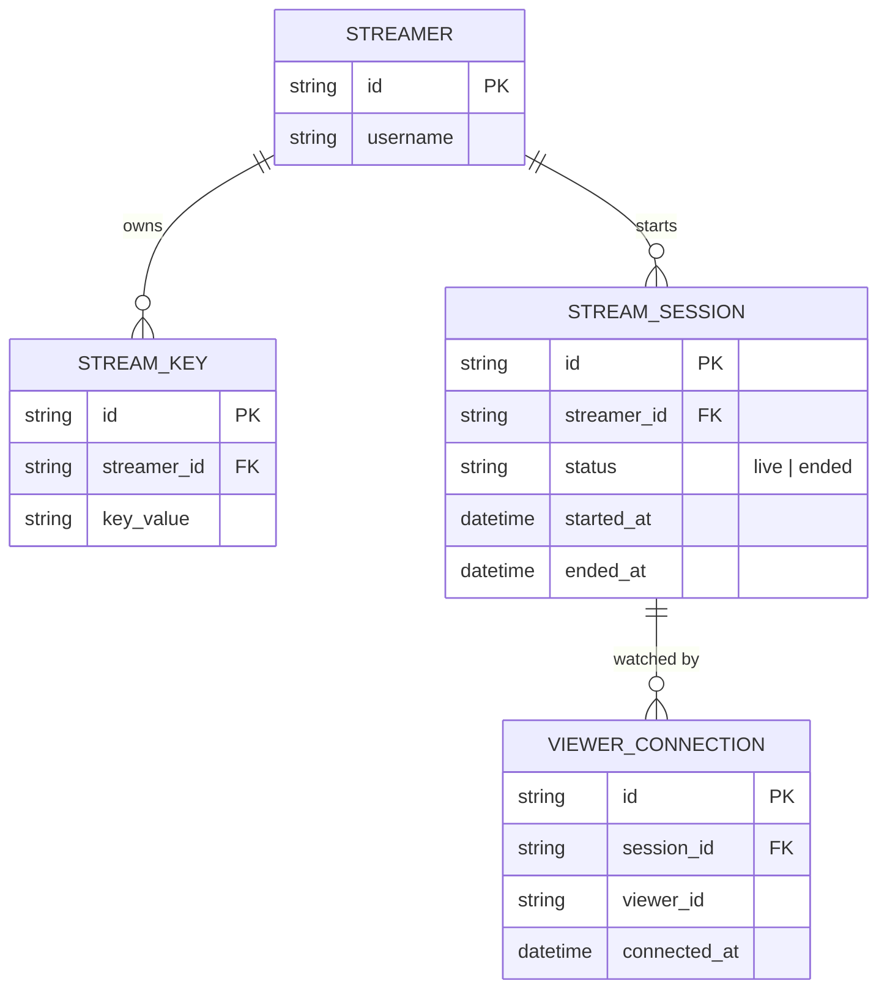

# Base ERD — Nền tảng streaming trước khi có xác thực key/ABR/chống gián đoạn/VOD/scale

Đây là **base**: mô hình dữ liệu suy luận từ ngữ cảnh đề bài, thể hiện trạng thái nền tảng streaming **trước khi** áp 5 yêu cầu cụ thể. Đề bài mô tả vai trò flow là "nhận RTMP/SRT, transcode, phân phối qua CDN" — nên base cần đủ: streamer, stream key (chưa có cơ chế revoke/kiểm tra), phiên live đơn giản (chỉ 2 trạng thái sống/kết thúc, không có trạng thái gián đoạn), và kết nối viewer cơ bản. Chưa có rendition đa bitrate, chưa có lưu segment cho VOD, chưa có khái niệm edge node/phân vùng tải — những phần đó là enhance.

