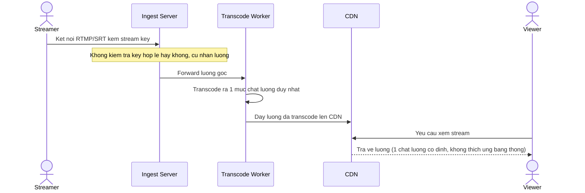

# Base sequence — Bắt đầu live: ingest, transcode 1 bitrate, phân phối CDN

Đây là **base**, mô tả flow bắt đầu live ở trạng thái hiện tại: ingest server nhận luồng RTMP/SRT mà không kiểm tra tính hợp lệ của stream key, transcode ra đúng 1 mức chất lượng (không có ABR), rồi đẩy thẳng qua CDN cho viewer. Đây là tiền đề để enhance thêm xác thực key (yêu cầu 1) và ABR nhiều bitrate (yêu cầu 2).

