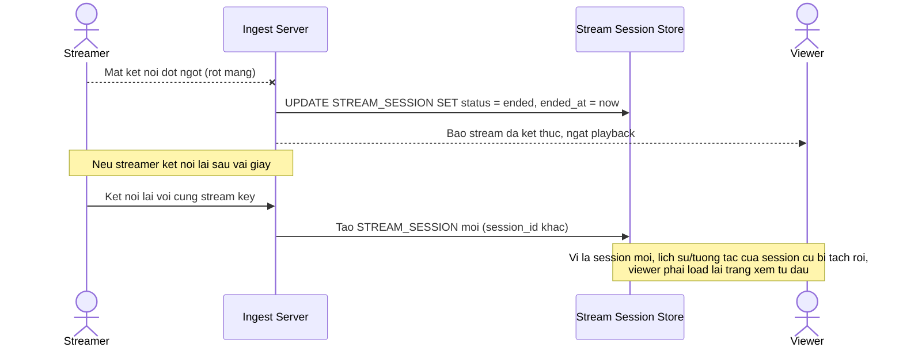

# Base sequence — Xử lý mất kết nối ingest (naive)

Đây là **base**, mô tả cách hệ thống hiện tại xử lý khi streamer mất kết nối: ingest phát hiện socket đóng và kết thúc phiên live ngay lập tức, không phân biệt mất mạng tạm thời hay streamer chủ động dừng, viewer bị ngắt xem hoàn toàn. Đây là tiền đề cho enhance yêu cầu 3 — phát hiện gián đoạn trong vài giây và tự khôi phục không tạo session mới.

