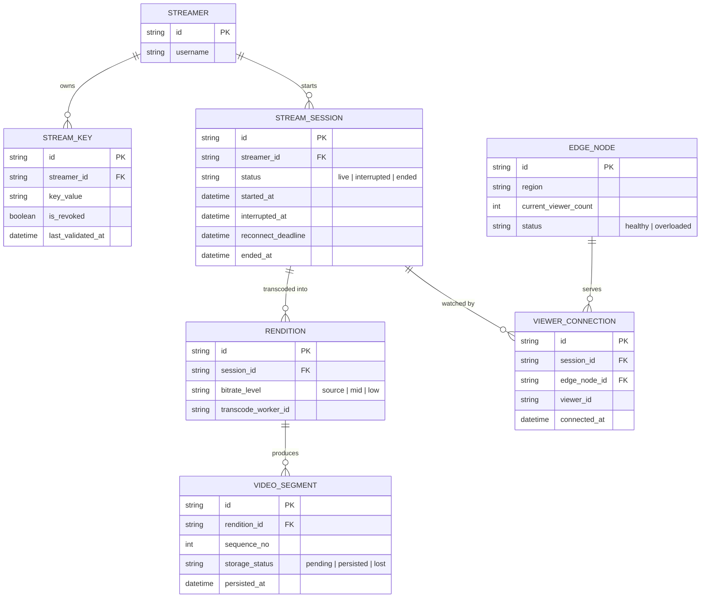

# Enhance ERD — Streaming platform với xác thực key, ABR, chống gián đoạn, VOD, chịu tải đột biến

Đây là **enhance**, mô hình dữ liệu sau khi áp toàn bộ 5 yêu cầu trong đề bài. So với base, các entity/field mới:
- `STREAM_KEY` thêm `is_revoked` và `last_validated_at` — ingest kiểm tra trước khi nhận luồng (yêu cầu 1).
- `STREAM_SESSION.status` mở rộng thêm giá trị `interrupted`, cùng `interrupted_at` và `reconnect_deadline` — phân biệt "gián đoạn tạm thời" với "kết thúc hẳn", cho phép khôi phục đúng session (yêu cầu 3).
- `RENDITION` (mới) đại diện 1 mức bitrate (nguồn/trung/thấp) được transcode từ 1 `STREAM_SESSION` — hỗ trợ ABR (yêu cầu 2).
- `VIDEO_SEGMENT` (mới) gắn với `RENDITION`, có `storage_status` và `persisted_at` để đảm bảo không mất segment khi worker transcode sự cố, phục vụ ghép VOD sau (yêu cầu 4).
- `EDGE_NODE` (mới) và `VIEWER_CONNECTION.edge_node_id` — mô hình hoá việc viewer được phân bổ vào các edge phân tán, phục vụ chịu tải đột biến (yêu cầu 5).

