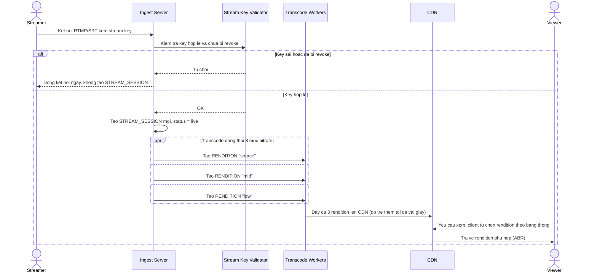

# Enhance sequence — Bắt đầu live với xác thực stream key và ABR 3 bitrate

Đây là **enhance** của flow `start-stream` đã có ở base. So với base (nhận luồng không kiểm tra key, chỉ transcode 1 chất lượng), flow này thay đổi ở 2 điểm: ingest xác thực stream key và từ chối ngay nếu sai/đã bị revoke, không tạo bất kỳ session nào cho luồng "ma" (yêu cầu 1); và transcode song song ra tối thiểu 3 mức bitrate (nguồn, trung, thấp) để phục vụ adaptive bitrate streaming, với độ trễ thêm chỉ vài giây (yêu cầu 2).

