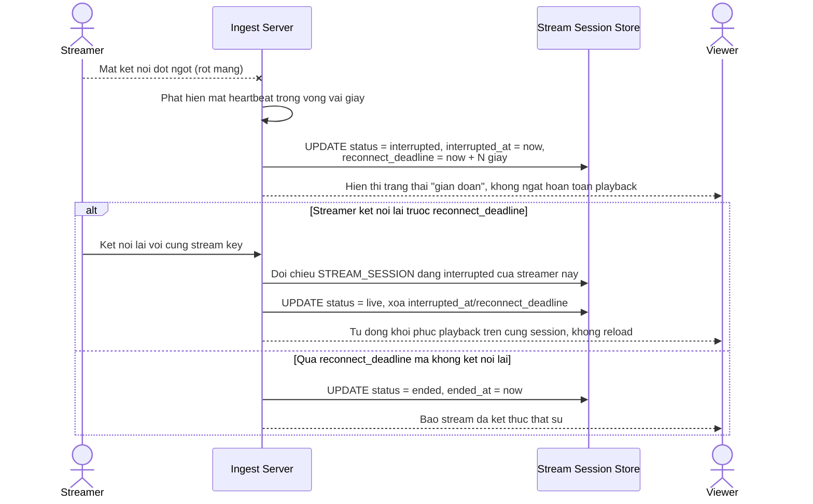

# Enhance sequence — Xử lý gián đoạn ingest với cửa sổ khôi phục

Đây là **enhance** của flow `handle-disconnect` đã có ở base. So với base (kết thúc session ngay khi mất kết nối, tạo session mới khi reconnect), flow này thay đổi ở chỗ: ingest phát hiện mất kết nối trong vài giây, chuyển session sang trạng thái `interrupted` (hiển thị "gián đoạn" cho viewer thay vì kết thúc hẳn) và giữ session mở trong 1 khoảng `reconnect_deadline`, streamer reconnect trong khoảng đó sẽ tiếp tục đúng session cũ — đáp ứng yêu cầu 3.

