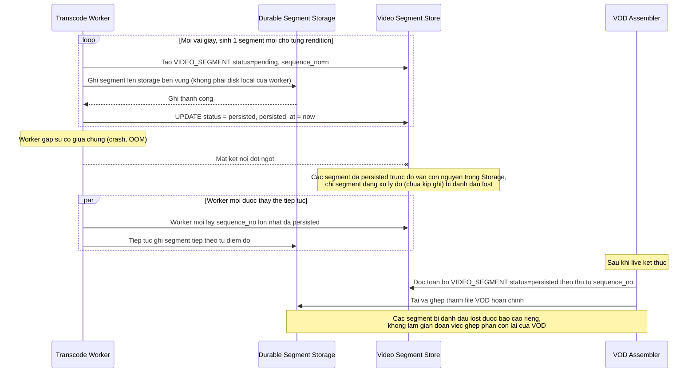

# Enhance sequence — Lưu segment bền vững phục vụ ghép VOD

Đây là **enhance**, flow hoàn toàn mới so với base (base không lưu trữ segment lâu dài, chỉ đẩy thẳng qua CDN cho live). Đáp ứng yêu cầu 4 trong đề bài: toàn bộ segment trong lúc live phải được lưu tạm để ghép VOD sau, và không được mất segment khi 1 worker transcode gặp sự cố giữa chừng.

