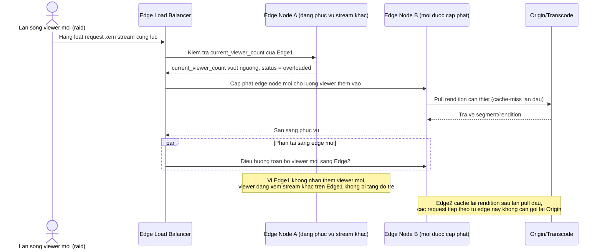

# Enhance sequence — Phân phối chịu tải viewer tăng đột biến (raid)

Đây là **enhance**, flow hoàn toàn mới so với base (base không có khái niệm edge node/mở rộng động, chỉ có 1 CDN chung). Đáp ứng yêu cầu 5 trong đề bài: khi lượng viewer đồng thời tăng đột biến (raid, streamer nổi tiếng lên live), kiến trúc phân phối phải mở rộng mà không làm tăng độ trễ cho các viewer khác đang xem stream khác.

