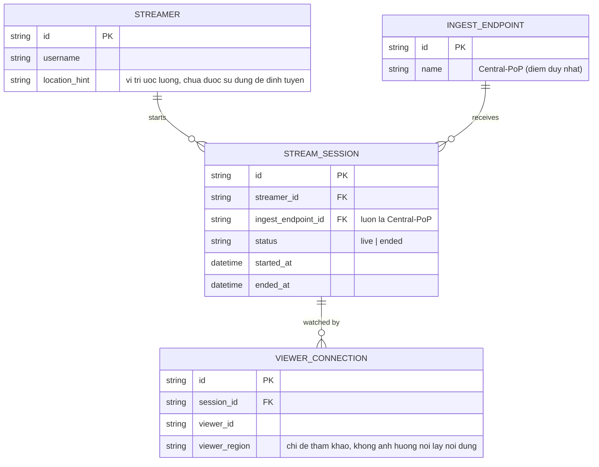

# Base ERD — Nền tảng gaming trước khi có ingest đa vùng

Đây là **base**: mô hình dữ liệu suy luận từ ngữ cảnh đề bài, thể hiện trạng thái nền tảng streaming gaming **trước khi** có định tuyến ingest đa vùng. Đề bài giả định hệ thống đã stream được (ingest, transcode, phân phối) nhưng chỉ qua **1 điểm ingest trung tâm duy nhất**, chưa phân biệt vùng địa lý của streamer/viewer. Base cần đủ: streamer, điểm ingest trung tâm, phiên live gắn cứng với điểm ingest đó, và viewer xem trực tiếp từ điểm ingest gốc. Chưa có khái niệm vùng địa lý, nhân bản nội dung, failover, hay theo dõi chi phí băng thông theo vùng — những phần đó là enhance.

