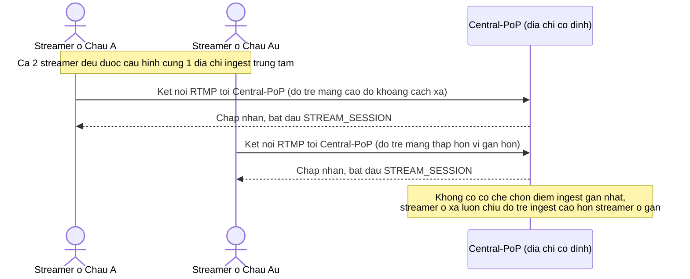

# Base sequence — Streamer kết nối ingest trung tâm cố định

Đây là **base**, mô tả flow streamer bắt đầu live ở trạng thái hiện tại: bất kể streamer ở khu vực địa lý nào, phần mềm phát luôn kết nối tới cùng 1 điểm ingest trung tâm được cấu hình cứng, không có bước đo độ trễ/định tuyến theo địa lý. Đây là tiền đề cho enhance yêu cầu 1 — tự động định tuyến tới ingest endpoint gần nhất.

