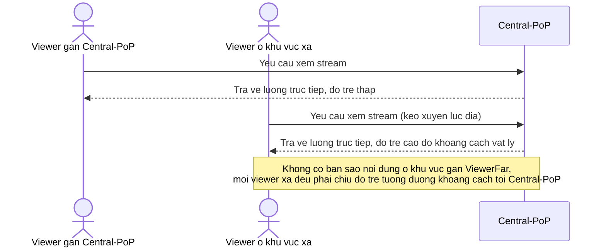

# Base sequence — Phân phối nội dung trực tiếp từ điểm ingest gốc

Đây là **base**, mô tả flow phân phối nội dung ở trạng thái hiện tại: mọi viewer, dù ở khu vực nào, đều kéo luồng trực tiếp từ điểm ingest trung tâm gốc, không có bước nhân bản nội dung ra khu vực gần viewer. Đây là tiền đề cho enhance yêu cầu 3 — nhân bản/phân phối nội dung tới các khu vực khác để viewer ở xa xem với độ trễ hợp lý.

