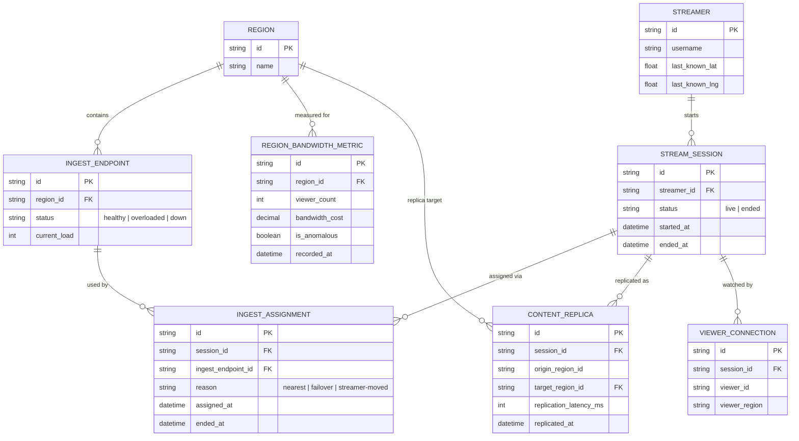

# Enhance ERD — Ingest đa vùng với định tuyến, failover, nhân bản và theo dõi chi phí

Đây là **enhance**, mô hình dữ liệu sau khi áp toàn bộ 5 yêu cầu trong đề bài. So với base, các entity/field mới:
- `REGION` (mới) đại diện 1 khu vực địa lý, chứa nhiều `INGEST_ENDPOINT` — nền tảng cho định tuyến theo địa lý (yêu cầu 1).
- `INGEST_ENDPOINT` thêm `region_id`, `status` (healthy/overloaded/down) và `current_load` — dùng để chọn điểm gần nhất và phát hiện sự cố cần failover (yêu cầu 1, 2).
- `INGEST_ASSIGNMENT` (mới) tách khỏi `STREAM_SESSION`: ghi lại lịch sử session được gán vào endpoint nào, khi nào, vì lý do gì (`nearest`/`failover`/`streamer-moved`) — cho phép đổi điểm ingest giữa buổi mà không tạo session mới (yêu cầu 2, 4).
- `CONTENT_REPLICA` (mới) ghi nhận việc nội dung từ 1 vùng ingest gốc được nhân bản sang vùng khác, kèm độ trễ đo được — phục vụ viewer ở xa (yêu cầu 3).
- `REGION_BANDWIDTH_METRIC` (mới) theo dõi chi phí băng thông và số viewer thực tế theo từng vùng theo thời gian, có cờ bất thường — phục vụ giám sát chi phí (yêu cầu 5).

