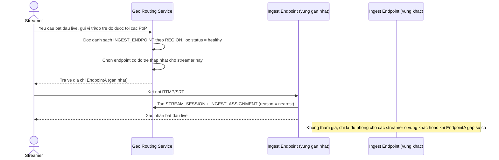

# Enhance sequence — Định tuyến streamer tới ingest endpoint gần nhất

Đây là **enhance** của flow `connect-ingest` đã có ở base. So với base (luôn kết nối tới 1 điểm ingest trung tâm cố định), flow này thay đổi ở chỗ: hệ thống đo độ trễ mạng/vị trí địa lý của streamer, tự động chọn `INGEST_ENDPOINT` gần nhất còn khoẻ mạnh trong đúng `REGION` phù hợp, không ép cứng 1 endpoint trung tâm — đáp ứng yêu cầu 1.

