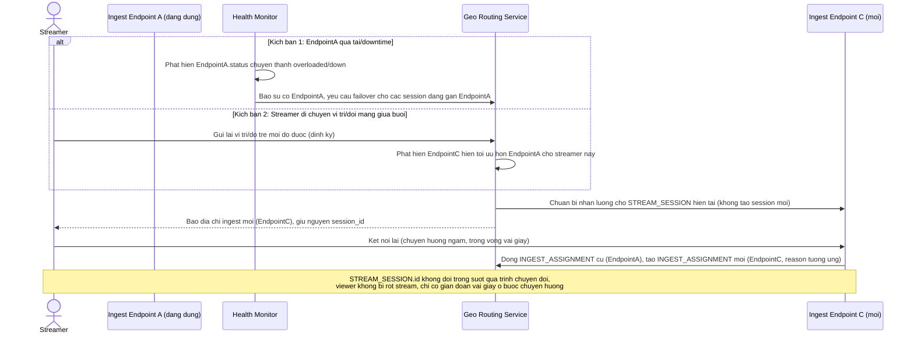

# Enhance sequence — Failover điểm ingest khi sự cố hoặc khi streamer di chuyển

Đây là **enhance**, flow hoàn toàn mới so với base (base không có khái niệm nhiều điểm ingest nên không cần failover). Đáp ứng đồng thời yêu cầu 2 (điểm ingest gần nhất gặp sự cố phải tự động failover, gián đoạn không quá vài giây, không cần streamer cấu hình lại thủ công) và yêu cầu 4 (streamer di chuyển giữa buổi live khiến điểm ingest tối ưu thay đổi, không được làm rớt stream) — cả 2 đều dùng chung cơ chế reassign `INGEST_ASSIGNMENT` mà giữ nguyên `STREAM_SESSION`.

