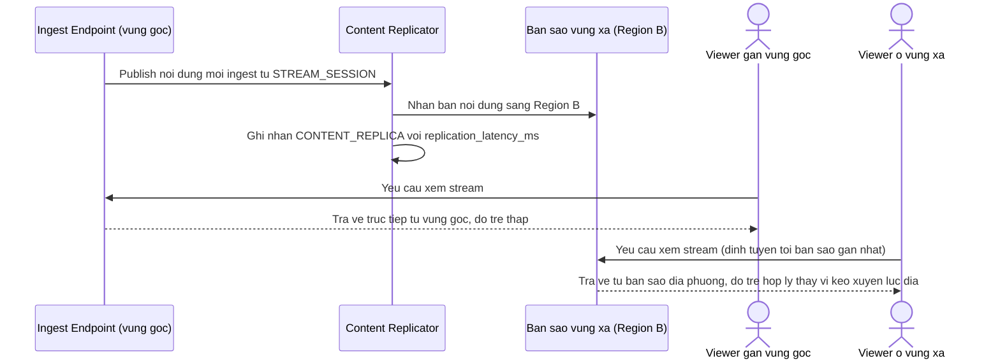

# Enhance sequence — Phân phối qua nhân bản nội dung liên vùng

Đây là **enhance** của flow `distribute-to-viewer` đã có ở base. So với base (mọi viewer kéo trực tiếp từ điểm ingest gốc), flow này thay đổi ở chỗ: nội dung sau khi ingest ở 1 vùng được nhân bản sang các vùng khác có viewer, viewer ở xa xem từ bản sao gần mình thay vì kéo xuyên lục địa từ điểm gốc — đáp ứng yêu cầu 3.

