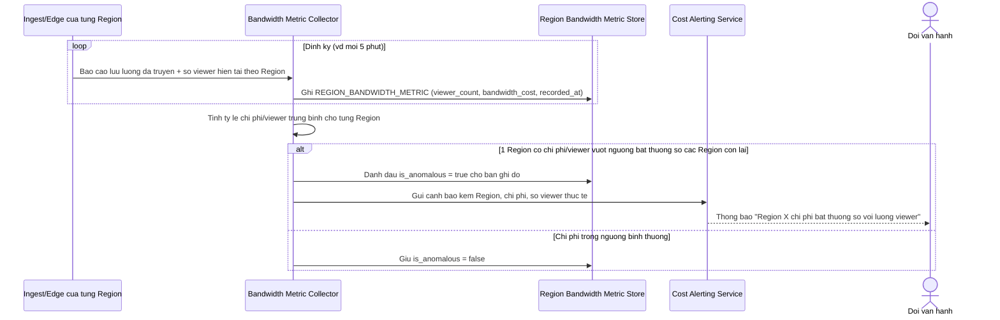

# Enhance sequence — Theo dõi chi phí băng thông theo vùng

Đây là **enhance**, flow hoàn toàn mới so với base (base không theo dõi chi phí theo vùng vì chỉ có 1 điểm ingest trung tâm). Đáp ứng yêu cầu 5 trong đề bài: theo dõi chi phí băng thông theo từng khu vực địa lý để tối ưu vận hành, cảnh báo khi 1 khu vực có chi phí bất thường so với số viewer thực tế.

