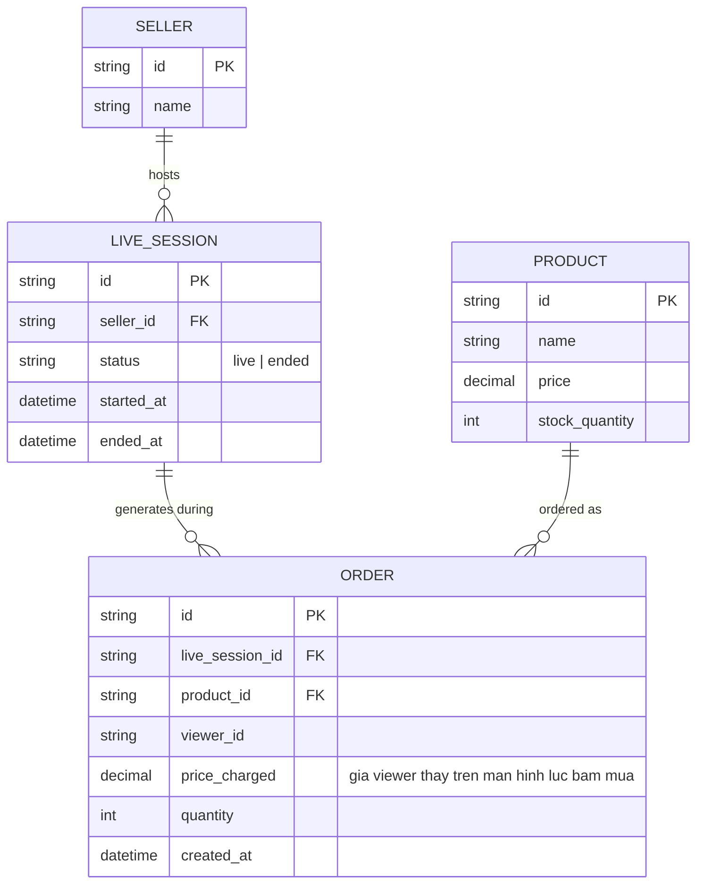

# Base ERD — Livestream bán hàng trước khi có đồng bộ thời gian chốt giá

Đây là **base**: mô hình dữ liệu suy luận từ ngữ cảnh đề bài, thể hiện trạng thái nền tảng livestream bán hàng **trước khi** có cơ chế đóng dấu thời gian sự kiện tại nguồn phát. Đề bài giả định hệ thống đã có ingest/phân phối stream và 1 luồng đặt hàng cơ bản trong lúc xem — nên base cần đủ: người bán, phiên live, sản phẩm (giá/tồn hiện tại), và đơn hàng viewer đặt dựa trên giá/tồn mà viewer nhìn thấy tại thời điểm bấm mua trên máy họ. Chưa có khái niệm sự kiện phát sóng được đóng dấu thời gian tại nguồn, chưa phân biệt gián đoạn/kết thúc phiên, chưa có hàng đợi checkout cách ly, chưa có mốc đồng bộ VOD — những phần đó là enhance.

