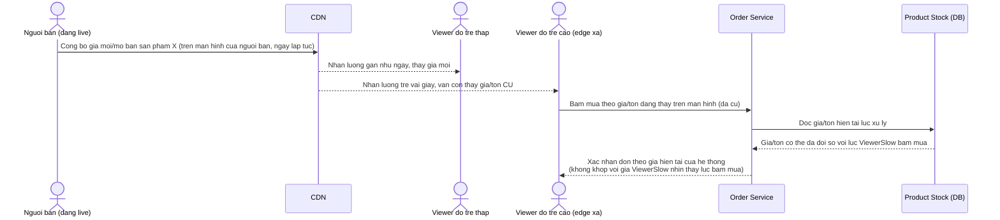

# Base sequence — Đặt hàng dựa trên giá/tồn hiển thị tại máy viewer

Đây là **base**, mô tả flow đặt hàng ở trạng thái hiện tại: viewer bấm mua dựa trên giá/tồn kho đang hiển thị trên màn hình của họ, hệ thống order xác nhận theo đúng giá trị đó mà không đối chiếu lại thời điểm sự kiện chốt giá/mở bán thực tế đã diễn ra tại nguồn phát khi nào. Đây là tiền đề cho enhance yêu cầu 1 và 3 — vấn đề nảy sinh khi viewer xem chậm hơn do độ trễ CDN khác nhau.

