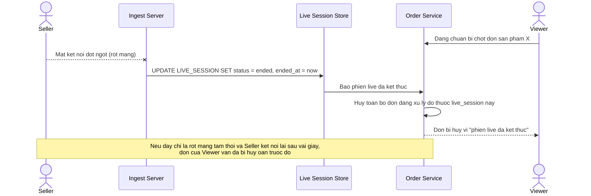

# Base sequence — Xử lý người bán mất kết nối (naive)

Đây là **base**, mô tả cách hệ thống hiện tại xử lý khi người bán rớt kết nối: hệ thống kết thúc phiên live ngay lập tức khi phát hiện mất luồng, không phân biệt mất mạng tạm thời hay live đã thực sự kết thúc, các đơn đang xử lý dở bị huỷ theo. Đây là tiền đề cho enhance yêu cầu 2 — phân biệt "gián đoạn tạm thời" và "kết thúc phiên".

