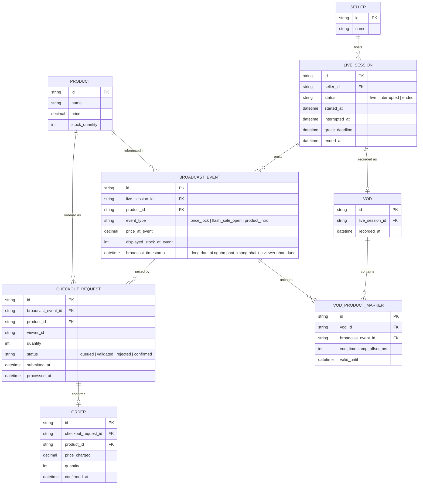

# Enhance ERD — Đồng bộ mốc phát sóng, phân biệt gián đoạn, cách ly checkout, đồng bộ VOD

Đây là **enhance**, mô hình dữ liệu sau khi áp toàn bộ 5 yêu cầu trong đề bài. So với base, các entity/field mới:
- `BROADCAST_EVENT` (mới): mỗi sự kiện chốt giá/mở bán được đóng dấu thời gian **ngay tại nguồn phát** (`broadcast_timestamp`), kèm `price_at_event` và `displayed_stock_at_event` — là "nguồn sự thật" để hệ thống order đối chiếu, không phụ thuộc thời điểm viewer bấm mua (yêu cầu 1).
- `LIVE_SESSION.status` mở rộng thêm `interrupted`, cùng `interrupted_at`/`grace_deadline` — phân biệt gián đoạn tạm thời với kết thúc hẳn (yêu cầu 2).
- `CHECKOUT_REQUEST` (mới) là hàng đợi trung gian tách biệt khỏi pipeline ingest/CDN: mỗi lượt bấm mua tạo 1 request tham chiếu `broadcast_event_id` (giá theo nguồn phát) và được đối chiếu lại `PRODUCT.stock_quantity` thực tại thời điểm xử lý, không tin tuyệt đối `displayed_stock_at_event` (yêu cầu 1, 3, 4).
- `VOD_PRODUCT_MARKER` (mới) gắn từng `BROADCAST_EVENT` với mốc thời gian trong file VOD và `valid_until` — đảm bảo viewer xem lại không mua được sản phẩm/giá đã hết hiệu lực (yêu cầu 5).

