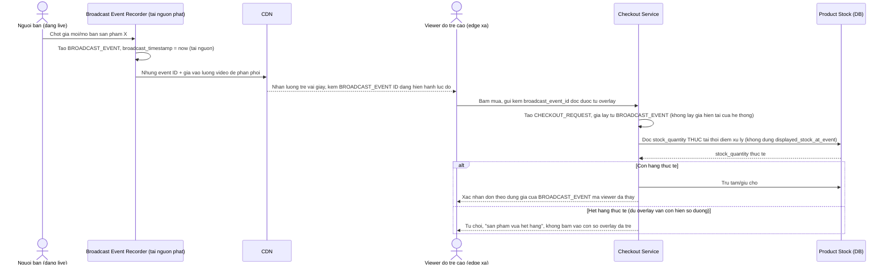

# Enhance sequence — Đặt hàng đối chiếu theo mốc phát sóng và tồn kho thực

Đây là **enhance** của flow `place-order-during-live` đã có ở base. So với base (order tin theo giá/tồn hiển thị trên máy viewer tại thời điểm bấm mua), flow này thay đổi ở chỗ: mọi `CHECKOUT_REQUEST` được gắn với `BROADCAST_EVENT` (giá đã đóng dấu thời gian tại nguồn phát) chứ không phải thời điểm viewer bấm mua (yêu cầu 1), và trước khi xác nhận đơn, hệ thống luôn đọc lại `PRODUCT.stock_quantity` thực chứ không tin `displayed_stock_at_event` trên overlay (yêu cầu 3).

