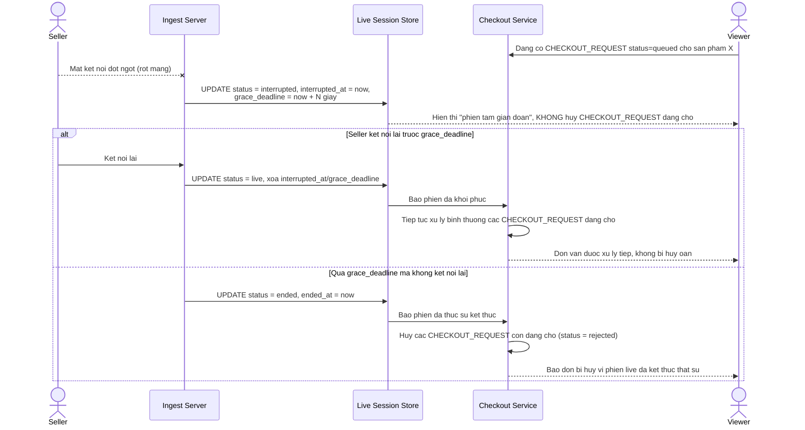

# Enhance sequence — Phân biệt gián đoạn tạm thời và kết thúc phiên live

Đây là **enhance** của flow `seller-disconnect` đã có ở base. So với base (kết thúc phiên và huỷ mọi đơn đang xử lý ngay khi mất kết nối), flow này thay đổi ở chỗ: hệ thống chuyển phiên sang trạng thái `interrupted` kèm `grace_deadline`, các `CHECKOUT_REQUEST` đang xử lý dở được giữ nguyên chờ, chỉ thực sự đóng phiên và huỷ đơn còn dang dở nếu quá hạn grace mà người bán không kết nối lại — đáp ứng yêu cầu 2.

