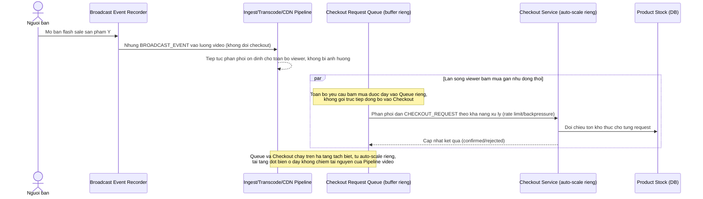

# Enhance sequence — Cách ly tải đột biến checkout khỏi pipeline video

Đây là **enhance**, flow hoàn toàn mới so với base (base không có cơ chế cách ly, mọi thứ xử lý đồng bộ chung 1 luồng). Đáp ứng yêu cầu 4 trong đề bài: thời điểm mở bán flash sale khiến viewer tăng đột biến trong vài giây, hệ thống phải cách ly để tải đột biến phía checkout không ảnh hưởng ngược lại tới độ ổn định luồng video đang phát cho các viewer khác.

