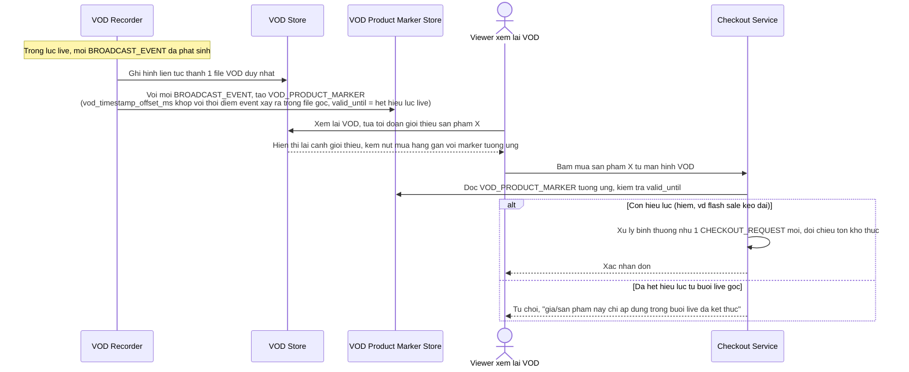

# Enhance sequence — Đồng bộ mốc sản phẩm khi xem lại VOD

Đây là **enhance**, flow hoàn toàn mới so với base (base không lưu mốc thời gian giới thiệu sản phẩm đồng bộ với VOD). Đáp ứng yêu cầu 5 trong đề bài: khi buổi live được ghi lại làm VOD, các mốc giới thiệu sản phẩm phải đồng bộ chính xác với luồng gốc, và viewer xem VOD không thể mua vào sản phẩm/giá đã hết hiệu lực từ buổi live gốc.

