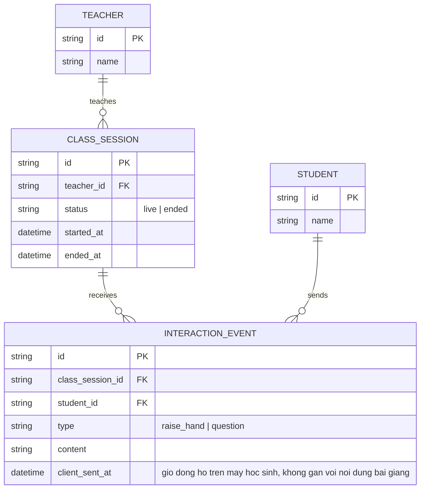

# Base ERD — Lớp học trực tuyến trước khi có đồng bộ tương tác/ổn định dài hạn

Đây là **base**: mô hình dữ liệu suy luận từ ngữ cảnh đề bài, thể hiện trạng thái nền tảng lớp học trực tuyến **trước khi** áp 5 yêu cầu cụ thể. Đề bài giả định hệ thống đã có luồng bài giảng từ giáo viên và kênh tương tác 2 chiều cơ bản — nên base cần đủ: giáo viên, phiên học (chỉ 2 trạng thái sống/kết thúc), học sinh, và sự kiện tương tác được ghi nhận theo giờ đồng hồ client đơn giản, không gắn với vị trí nội dung bài giảng. Chưa có khái niệm worker ingest luân phiên để chạy ổn định dài hạn, chưa có mốc thời gian nội dung bài giảng cho tương tác, chưa phân biệt gián đoạn/kết thúc, chưa có bản ghi kèm marker đồng bộ — những phần đó là enhance.

