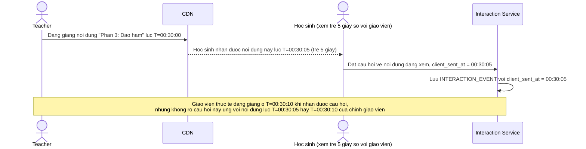

# Base sequence — Học sinh tương tác theo giờ đồng hồ client (naive)

Đây là **base**, mô tả flow học sinh giơ tay/đặt câu hỏi ở trạng thái hiện tại: sự kiện được gắn `client_sent_at` là giờ đồng hồ trên máy học sinh tại thời điểm bấm, không phản ánh vị trí thực trong bài giảng mà học sinh đang xem (do độ trễ phân phối). Đây là tiền đề cho enhance yêu cầu 2 — cần gắn đúng mốc nội dung bài giảng, không phải giờ bấm.

