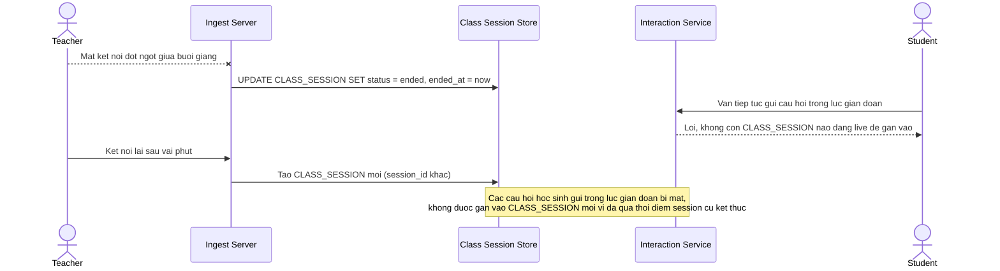

# Base sequence — Xử lý giáo viên mất kết nối (naive)

Đây là **base**, mô tả cách hệ thống hiện tại xử lý khi giáo viên mất kết nối giữa buổi giảng: phiên học kết thúc ngay lập tức, học sinh kết nối lại phải vào 1 phiên mới, các tương tác phát sinh trong lúc gián đoạn bị thất lạc do không còn gắn với phiên nào còn hoạt động. Đây là tiền đề cho enhance yêu cầu 3 — khôi phục đúng vị trí trong buổi học mà không tạo phiên mới và không mất tương tác.

