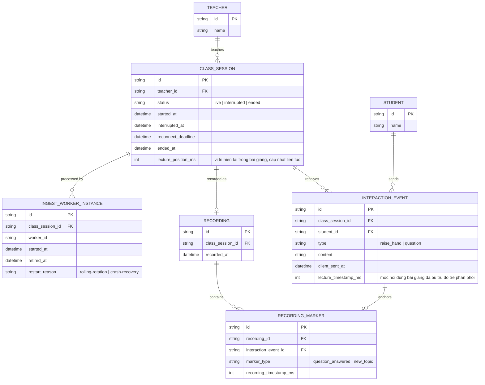

# Enhance ERD — Lớp học dài giờ với ổn định ingest, đồng bộ tương tác, phục hồi, VOD

Đây là **enhance**, mô hình dữ liệu sau khi áp toàn bộ 5 yêu cầu trong đề bài. So với base, các entity/field mới:
- `INGEST_WORKER_INSTANCE` (mới): mỗi worker xử lý ingest/ghi hình cho 1 `CLASS_SESSION` được luân phiên thay thế định kỳ (`retired_at`, `restart_reason`) mà không cần dừng phiên học — phục vụ vận hành ổn định lâu dài, tránh rò rỉ tài nguyên tích luỹ qua nhiều giờ (yêu cầu 1).
- `CLASS_SESSION` thêm `lecture_position_ms` (vị trí nội dung bài giảng hiện tại, cập nhật liên tục) và mở rộng `status` với `interrupted`/`interrupted_at`/`reconnect_deadline` — nền tảng để gắn đúng mốc nội dung cho tương tác (yêu cầu 2) và phân biệt gián đoạn/kết thúc (yêu cầu 3).
- `INTERACTION_EVENT` thêm `lecture_timestamp_ms` (mốc nội dung bài giảng thực tại thời điểm học sinh tương tác, đã bù trừ độ trễ phân phối) thay vì chỉ dựa vào giờ đồng hồ client (yêu cầu 2), và không bị mất khi phiên `interrupted` (yêu cầu 3).
- `RECORDING` + `RECORDING_MARKER` (mới): bản ghi buổi học gắn các marker đồng bộ chính xác theo `recording_timestamp_ms`, tham chiếu tới `INTERACTION_EVENT` gốc — tránh lệch do độ trễ tích luỹ qua nhiều giờ ghi hình (yêu cầu 4).

