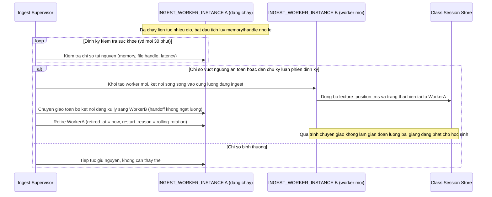

# Enhance sequence — Ingest ổn định dài giờ qua luân phiên worker

Đây là **enhance**, flow hoàn toàn mới so với base (base không có cơ chế luân phiên worker, ngầm định 1 worker chạy suốt buổi). Đáp ứng yêu cầu 1 trong đề bài: buổi học kéo dài nhiều giờ liên tục phải vận hành ổn định, tránh rò rỉ tài nguyên/tích luỹ lỗi nhỏ theo thời gian, mà không cần restart giữa chừng làm gián đoạn giờ học.

